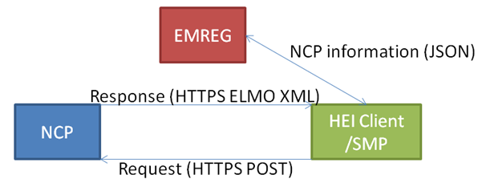

Standards document
==================

Scope
-----

This standard specifies the characteristics of a process for securely transferring educational results for a student between two institutions.
Key users of this standard will be:
  *	Countries, consortiums or institutions that wish to electronically share results 
  *	Institutions that wish to electronically receive results from other institutions 
  *	Student that uses EMREX to fetch results

Terms and definitions
---------------------

For the purpose of this document, the following terms and definitions apply:
  *	**Home institution:** This is the institution where the student has his main studies
  *	**Host institution:** This is the institution where the student has a semester or two of studies and from where she wishes to fetch results from back to the home institution
  *	**Request:** A technical request sent via HTTP
  *	**Response:** A technical response sent via HTTP
  *	**Session:** A session is in EMREX is the is the technical term for the whole process the student goes through to fetch data: From login in at home institution to fetching results and returning them should all be part of the same session. This is to ensure that at no point during the result transfer, the process has been tampered with

Architecture
------------

In its most basic form, the EMREX network can be drawn like this:

There are 3 basic components of the network
  1. **NCP:** Stands for National Contact Point and is the point the EMREX client accesses to get results from the host institution. There can be several NCP's in a network and this NCP can represent either one or several host institutions. The most usual solution is that an NCP represents all the institutions in one country. The NCP's implementation may vary from country to country. However, the NCP has four basic functions that must be complied to:
    i. Receive and handle a request from the client. This request is a POST over HTTPS
    ii. Provide a secure login for the student in order to verify the student
    iii. Allow the student to select their results from the proper host institution
    iiii. Return a correct response to the client. This response is a signed XML document with the ELMO XML
  2. **HEI Client/SMP:** SMP is short for Student Mobility Plugin. A HEI client/SMP is an application at the home institution that initiates the transfer of results from host institution to the home institution. This is most usually a web application, but again, the implementations may vary from country to country. However, the client has four basic functions that must be complied to:
    i. Fetch NCP information from the EMREG component and display available NCP's to the student
    ii. Send a correct request to the proper NCP
    iii. Handle the response from the NCP and verify the results
    iiii. Store the results in the home institutions student information system
  3. **EMREG:** Short for EMREX Registry and is the only central component in the EMREX network, meaning there is only one. EMREG holds a list of all approved NCP's in the EMREX network. The EMREX clients can query the EMREG in order to display available NCP's to the student who wishes to select their host institution

### Standard data: NCP Information

The information in EMREG is a list of available NCPs, written in the JSON (JavaScript Object Notation) language and contains the following information:
  1. **Acronym:** This is the acronym for the NCP and is only used for display purposes.
  2. **Institutions:** A list of host institutions the NCP is able to fetch results from.
  3. **Country code:** An ISO 3166-1 alpha-2 code representing the nationality of the NCP
  4. **URL:** The URL is the contact point the client will use when requesting results
  5. **Public key:** The public SSL key for the NCP, used to verify digitally signed messages

### The client request

When a student wishes to fetch results from a host institution, a request is sent from the client to the appropriate NCP. The request is an HTTP POST to the URL specified in EMREG. The request contains the following information:
  1. **Session ID:** The session ID is a random generated 32 character string. This is received by the NCP and returned to the client in the response. If the session ID that is returned in the response does not match the session ID in the request, there is a chance that someone has tampered with the data, and the response should discarded
  2. **Return URL:** The return URL is an URL where the client can receive responses from the NCP. When the NCP replies, it must use this URL

### The NCP response

Once the NCP has collected all the student's results, the results can be returned to the client. The response is sent as an HTTP POST on the URL provided in the client request. The response contains the following information:
  1. **Session ID:** This is the same session ID as in the client request. This is so the client can verify that the response comes from the same NCP as it sent its request to
  2. **Return message:** A message from the NCP to the client, for instance in the case where there was an error on the NCP
  3. **Return code:** A code telling the client if the operation on the NCP side was successful. As of today, the following codes are used:
    i. **NCP_OK:** Everything went well, results have been transferred
    ii. **NCP_ERROR:** Something went wrong, see return message for details
    iii. **NCP_NO_RESULTS:** There were no results to import into the client
    iiii. **NCP_CANCEL:** The user has cancelled
  4. **ELMO:** The results in the ELMO-XML format. The ELMO format is described in a later section. The ELMO is signed by the NCP, using its private SSL key. This signature is verified by the client, using the public ssl key, provided by EMREG

The ELMO format
---------------

The ELMO format is the core of the data exchange. All of the students' results are described using ELMO. The format is based on the standards EN15981 EuroLMAI and EN15982 MLO and is written in XML. The ELMO format is based on three major parts:
  1. **Learner:** The student
  2. **Issuer:** The host institution
  3. **Learning opportunity:** A chance to participate in education or training

The course structure is built up of multiple **Learning Opportunity Specifications (LOS)**. The LOS is an abstract description of a learning opportunity, consisting of information that will be consistent across multiple instances of the learning opportunity. This structure can be hierarchical, meaning it is possible to build an entire degree and course structure using LOS. Inside an LOS, there is a **Learning Opportunity Instance (LOI)**. A LOI is a single occurrence of a learning opportunity. Unlike a LOS a LOI is not abstract, may be bound to particular dates or locations, and may be applied for or participated in by learners. It is the LOI the will give the student specific information about the LOS in the ELMO format.

Security
--------

The EMREX network needs to be secure in order to ensure trust in the network. This is achieved through 3 approaches:
  1. **HTTPS:** EMREX will be enforcing the use of HTTPS (HTTP Secure) to transfer data
  2. **ELMO signing:** A part of the secure standard is to digitally sign the ELMO XML using the private key on the NCP. The public key, used to verify the signature on the client, is stored in EMREG
  3. **Session ID:** The client and NCP will be using session ids in the exchange of data. This is to verify that the data transfer is part of the same session. Simply put, the client sends a session id to the NCP as part of the request, and the NCP returns the same session id to the client for verification
