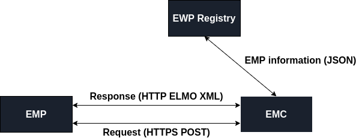

Standards document
==================

Scope
-----

This standard specifies the characteristics of a process for securely transferring educational results for a student between two institutions.
Key users of this standard will be:
  *	Countries, consortiums or institutions that wish to electronically share results 
  *	Institutions that wish to electronically receive results from other institutions 
  *	Student that uses EMREX to fetch results

Terms and definitions
---------------------

For the purpose of this document, the following terms and definitions apply:
  *	**Home institution:** This is the institution where the student has his main studies
  *	**Host institution:** This is the institution where the student has a semester or two of studies and from where she wishes to fetch results from back to the home institution
  *	**Request:** A technical request sent via HTTP
  *	**Response:** A technical response sent via HTTP
  *	**Session:** A session is in EMREX is the is the technical term for the whole process the student goes through to fetch data: From login in at home institution to fetching results and returning them should all be part of the same session. This is to ensure that at no point during the result transfer, the process has been tampered with

Publications
------------

[EMREX handbook](binary/EMREX-handbook.pdf)  
[Technical guide to EMREX](binary/Technical-Guide-to-EMREX.pdf)

Architecture
------------

In its most basic form, the EMREX network can be drawn like this:

There are 3 basic components of the network
  1. **EMP:** Stands for EMREX Contact Point and is the point the EMREX client accesses to get results from the host institution. There can be several EMP's in a network and this EMP can represent either one or several host institutions. The most usual solution is that an EMP represents all the institutions in one country. The EMP's implementation may vary from country to country. However, the EMP has four basic functions that must be complied to:
      1. Receive and handle a request from the client. This request is a POST over HTTPS
      2. Provide a secure login for the student in order to verify the student
      3. Allow the student to select their results from the proper host institution
      4. Return a correct response to the client. This response is a signed XML document with the ELMO XML
  2. **EMC:** Stands for EMREX Client. An EMC is an application at the home institution that initiates the transfer of results from host institution to the home institution. This is most usually a web application, but again, the implementations may vary from country to country. However, the client has four basic functions that must be complied to:
      1. Fetch EMP information from the EMREG component and display available EMP's to the student
      2. Send a correct request to the proper EMP
      3. Handle the response from the EMP and verify the results
      4. Store the results in the home institutions student information system
  3. **EWP Registry:** The only central component in the EMREX network, meaning there is only one. The registry holds a list of all approved EMP's in the EMREX network. The EMREX clients can query the registry in order to display available EMP's to the student who wishes to select their host institution

Technical guide
---------------

The technical guide is available at the following link:
[Technical guide](pages/technical-guide.md)

Standard data: EMP Information
------------------------------

The information in EWP Registry is a list of available EMPs, written in the JSON (JavaScript Object Notation) language and contains the following information:
  1. **Acronym:** This is the acronym for the EMP and is only used for display purposes.
  2. **Institutions:** A list of host institutions the EMP is able to fetch results from.
  3. **Country code:** An ISO 3166-1 alpha-2 code representing the nationality of the EMP
  4. **URL:** The URL is the contact point the client will use when requesting results
  5. **Public key:** The public SSL key for the EMP, used to verify digitally signed messages

The client request
------------------

When a student wishes to fetch results from a host institution, a request is sent from the client to the appropriate EMP. The request is an HTTP POST to the URL specified in EMREG. The request contains the following information:
  1. **Session ID:** The session ID is a random generated 32 character string. This is received by the EMP and returned to the client in the response. If the session ID that is returned in the response does not match the session ID in the request, there is a chance that someone has tampered with the data, and the response should discarded
  2. **Return URL:** The return URL is an URL where the client can receive responses from the EMP. When the EMP replies, it must use this URL

The EMP response
----------------

Once the EMP has collected all the student's results, the results can be returned to the client. The response is sent as an HTTP POST on the URL provided in the client request. The response contains the following information:
  1. **Session ID:** This is the same session ID as in the client request. This is so the client can verify that the response comes from the same EMP as it sent its request to
  2. **Return message:** A message from the EMP to the client, for instance in the case where there was an error on the EMP
  3. **Return code:** A code telling the client if the operation on the EMP side was successful. As of today, the following codes are used:
      1. **NCP_OK:** Everything went well, results have been transferred
      2. **NCP_ERROR:** Something went wrong, see return message for details
      3. **NCP_NO_RESULTS:** There were no results to import into the client
      4. **NCP_CANCEL:** The user has cancelled
  4. **ELMO:** The results in the ELMO-XML format. The ELMO format is described in a later section. The ELMO is signed by the EMP, using its private SSL key. This signature is verified by the client, using the public ssl key, provided by EMREG

The ELMO format
---------------

The ELMO format is the core of the data exchange. All of the students' results are described using ELMO. The format is based on the standards EN15981 EuroLMAI and EN15982 MLO and is written in XML. The ELMO format is based on three major parts:
  1. **Learner:** The student
  2. **Issuer:** The host institution
  3. **Learning opportunity:** A chance to participate in education or training

The course structure is built up of multiple **Learning Opportunity Specifications (LOS)**. The LOS is an abstract description of a learning opportunity, consisting of information that will be consistent across multiple instances of the learning opportunity. This structure can be hierarchical, meaning it is possible to build an entire degree and course structure using LOS. Inside an LOS, there is a **Learning Opportunity Instance (LOI)**. A LOI is a single occurrence of a learning opportunity. Unlike a LOS a LOI is not abstract, may be bound to particular dates or locations, and may be applied for or participated in by learners. It is the LOI the will give the student specific information about the LOS in the ELMO format.

Security
--------

The EMREX network needs to be secure in order to ensure trust in the network. This is achieved through 3 approaches:
  1. **HTTPS:** EMREX will be enforcing the use of HTTPS (HTTP Secure) to transfer data
  2. **ELMO signing:** A part of the secure standard is to digitally sign the ELMO XML using the private key on the EMP. The public key, used to verify the signature on the client, is stored in EMREG
  3. **Session ID:** The client and EMP will be using session ids in the exchange of data. This is to verify that the data transfer is part of the same session. Simply put, the client sends a session id to the EMP as part of the request, and the EMP returns the same session id to the client for verification

Examples
--------

Below is a list of example certificates from various countries:

### Finland
[Diploma 01](examples/Finland/Diploma-Example-Finland-01.pdf)  
[Diploma 01](examples/Finland/Diploma-Example-Finland-02.pdf)

### Netherlands
[Diploma](examples/Netherlands/Diploma-Example-Netherlands.pdf)

### Norway
[Bachelor Diploma](examples/Norway/Bachelor-Diploma-Example-Norway.pdf)  
[Bachelor Diploma Supplement](examples/Norway/Bachelor-Diploma-Supplement-Norway.pdf)  
[Master Diploma](examples/Norway/Master-Diploma-Example-Norway.pdf)  
[Master Diploma Supplement](examples/Norway/Master-Diploma-Supplement-Norway.pdf)  
[PHD Diploma](examples/Norway/PHD-Diploma-Example-Norway.pdf)  
[PHD Diploma Supplement](examples/Norway/PHD-Diploma-Supplement-Norway.pdf)

### Poland
[Bachelor Diploma](examples/Poland/Bachelor-Diploma-Example-Poland.pdf)  
[Master Diploma](examples/Poland/Master-Diploma-Example-Poland.pdf)

### Sweden
[Diploma](examples/Sweden/Diploma-Example-Sweden.pdf)

EMREX demo system
-----------------

The testing page describes how to test the different components in the participating countries. The same instructions can of course be used for demonstrating the solution to interested parties. In addition the following set-up and instructions have been prepared to help run a successful and impressive demo.

Note: before running an important demo, make sure to contact the corresponding partners and check that there aren’t any planned downtime for the system at that time. The demo uses test systems that can be changed or taken offline as part of normal development work.

Send email to emrex-support@emrex.eu to inform about the demo, include information about time and which part of the EMREX network you plan to use in the demo.

[Instruction for demo set-up Finland (EMC) - Norway (EMP)](binary/Demo-FinnishEMC-NorwegianEMP.pdf)

[Instructions for demo set-up Finland (EMC) - Sweden (EMP](binary/Instructions-for-testing-EMREX-between-Finland-and-Sweden.pdf)

An end-to-end demo has been prepared and can be used at conferences or meetings, where you want to show how EMREX works. The set-up uses one common student, Kaisa Keränen, that has access right both to the Finnish EMC and results in the Swedish EMP. That is, the story is that she is a Finnish student that has been on an exchange in Sweden.

To run the demo:

1. Go to emrextest.csc.fi/smp

2. Select Haka test-idp from the list and log on as Kaisak with password keränen

3. From the Finnish EMC select Sweden

4. In the Swedish EMP, fill in Names and Date of birth and choose what data-set you want to use.

5. In the Swedish EMP you can now review all Kaisa’s results in Sweden. Select or delselect. It is also possible to ope up a course and see the classes connected to it. Select some courses and press Next

7. Approve and import and you are sent back to the FinniEMCsh EMC. The results are also transferred back to the EMC as elmo-xml (not seen in the demo). You can also save and open the pdf to show what the student can get for himself.

8. Import and you are done.