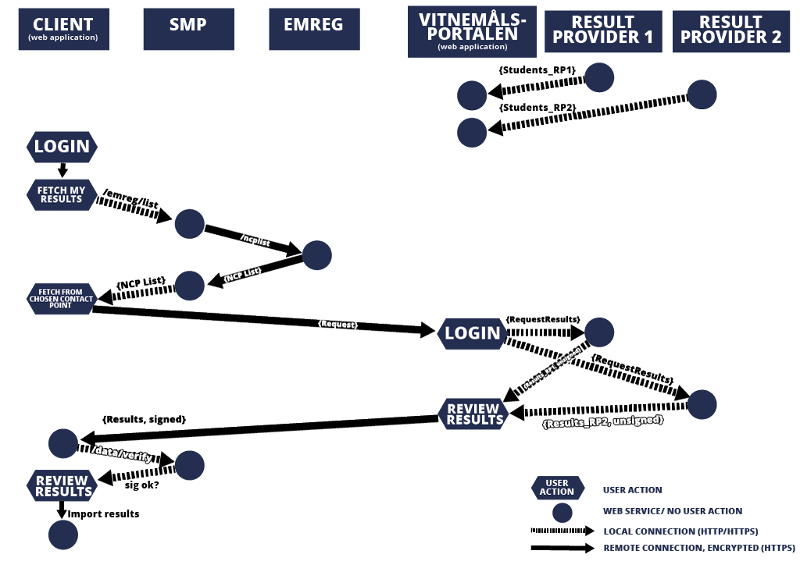

EMREX Technical Guide
=====================

[Standards guide](../README.md)

This is a technical description of EMREX, here you can find information on what has to be implemented locally to connect to the EMREX network.
Each Higher Education Institution (HEI) has two roles in the EMREX network:

1. Provide the student with application(s) which allow them to fetch their result from another HEI, either in the same country or from abroad. This will later on be referred to as the EMREX Client (EMC)

2. Provide client(s) with functionality to fetch assessments (results from courses, qualification) from the databases containing this information. This will later on be referred to as the EMREX Contact Point (EMP). The EMP can be hosted by a single HEI which provides access to their records or can be a federalized system throough which multiple HEIs provide access to their record database(s).

Implementation specifics
------------------------

Because EMREX is a decentralized system, there is no major component that each country can reuse. The EMREX project does provide some modules, plugins and examples that can be used and built upon, however there are a couple of issues that cannot be solved in a general way:

1. Authenticating a student.

Each country has their own way of authenticating a student in their system. In Norway there are Feide and ID-Porten, Finland has Haka, Sweden has Swamid and so on. Therefore, the EMREX project cannot make a complete login module and distribute this, as each country solves this in different ways.

2. Fetching results for a student.

Each HEI has their own student information systems. Some HEIs use national country level data sources that can provide this information. Therefore, there is not one unified way of fetching results from these systems. The EMREX system is dependent on connecting to an existing solution that can fetch results for a given HEI. The preferred solution is to build a REST service for each student information system involved, that provides ELMO formatted data.

3. Storing results for a student.

Each HEI has their own student information systems. So there is no standard way of storing the result data the EMREX fetches into the existing student system. When the EMREX Client returns a set of results for a student, these must be stored in some local system, as EMREX does not store the data in itself.
There a 5 main parts that will be referred to through this document:
Common components of EMREX (no local work required):
Some local work required:

1. EMP (EMREX Contact Point)

EMREX Contact Point. This is the point that the EMREX Client contacts to fetch results.
Potentially much local work required.

2. EMC (EMREX Client)

This is the web application that the student uses to initiate the transfer of their results from another country. (could be integrated into the HEI SIS, i.e. work needed by the HEI)

3. EWP Registry

This is a central registry the EMREX uses to fetch the data that is needed to complete the result transfer. This is also the only centralized component in the EMREX system. The ccomponent is used to resolve the authenticity of EMPs.

4. Results Services

These are the services that are used by the EMP to fetch the results for the students. If you have an existing system that handles this, the EMP can simply connect to this. However, if none exist, there may be a major job to implement this.

Architecture
------------

The following diagram shows in detail the data flow for a student wanting to import results from two different result providers (for instance, higher education institutions) in the same country.

It is up to each implementer to decide whether the EMC will run as a standalone service, or embedded into their client. The EMREX project provides a EMC library which can be used out-of-the-box as a standalone service.

The same remark applies to the result provider(s), the implementation is very  much dependent on the underlying system(s).

[Choosing the EMP](choosing-the-emp.md)

[Sending a request to the EMP](sending-a-request-to-the-emp.md)

[Receiving a response](receiving-a-response.md)

[Interpreting and handling the data](interpreting-and-handling-the-data.md)